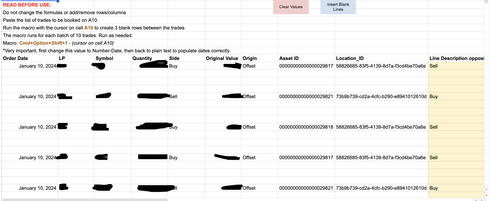
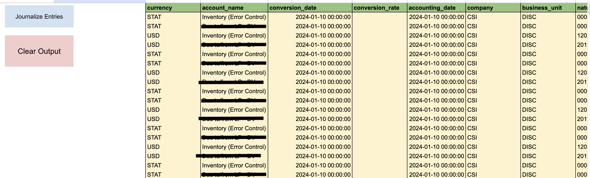

# Oracle Breaks Automation
This automation was created as part of my role as a Product Operations Associate at Wealthsimple. 

## Stack
This automation was coded with **Apps Script** on Google Sheets. The language used is Javascript. 

## Background
As part of Wealthsimple's operations, all crypto transactions are tracked and booked on an accounting ledger on Oracle. 

As part of our error resolution process, offset entries are occasionally required to fix previously booked entries. This automation will take the original entries made in Oracle, and return the entries required to reverse them. 

*Sensitive information has been removed from the code, including the names of the liquidity providers that Wealthsimple works with. They are referred to as LP1, LP2 and LP3 in the code. 

## User Experience

Above is the input sheet that users see when they first access the program. Here they will paste all the Oracle entry that needs to be reversed. When the user clicks on the "Insert Blank Lines" button, 3 blank lines will be inserted between each entry. This is done so that the correcting entries can be made.

### Journalize the Entries

After blank lines have been inserted, the user goes over to the Output sheet to generate all the offset entries required. Now all the user has to do is download the file as a CSV and upload it to Oracle.